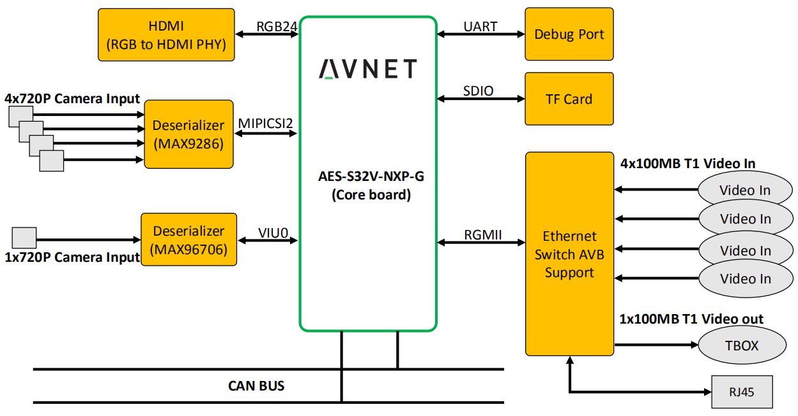

# AES-S32V-NXP-G Documentation and VisionSDK demos

## Overview

This repository contains a modified version of S32v234 VisionSDK(REV1.2.0) in the [SW32V23-VSDK001-RTM-1.2.0](https://nxp.flexnetoperations.com/control/frse/download?element=10313807).  The code has been ported to the AES-S32V-NXP-G.

## Folder structure

    .
    ├── documentation                           # design guide, user guide, bom and schematics
    │   ├── AES-S32V-NXP-G EVK Designers-Guide-rev-1.1.pdf
    │   ├── AES-S32V-NXP-G EVK Software-Guide-rev-1.1.pdf
    │   ├── BOM
    │   └── SCH
    ├── images                                  #pre-build SD Card binaries
    │   ├── Image
    │   ├── rootfs.tar.gz
    │   ├── s32v234avnet-evb.dtb
    │   ├── start_max96076.sh
    │   └── u-boot.s32
    ├── media
    │   └── aes-s32v-nxp-g_diagram.png
    ├── README.md
    └── s32v234_vsdk_avnet_1.2.0                #modified version of visionSDK
        ├── 3rdparty
        ├── build
        ├── demos
        ├── envbuild.sh
        ├── include
        ├── isp
        ├── kernels
        ├── libs
        ├── os
        ├── platform
        ├── ReleaseConfiguration.txt
        └── tools

## User guide

please refer to [AES-S32V-NXP-G EVK Software-Guide](./documentation/AES-S32V-NXP-G%20EVK%20Software-Guide-rev-1.1.pdf)
